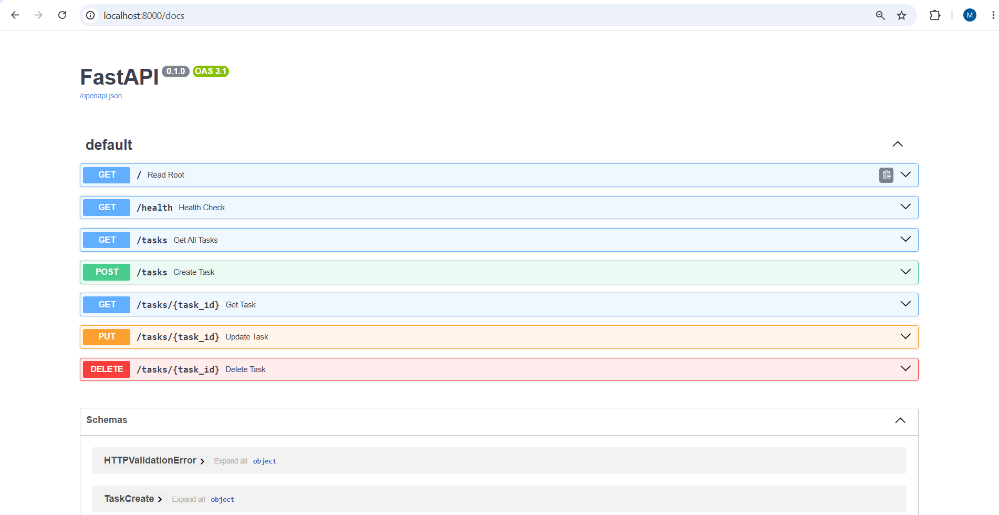

# FlyRank To-Do List API

A professional, fully documented, in-memory CRUD API for managing a To-Do list. Built with **FastAPI** and **Python** as part of the FlyRank Backend AI Engineering Internship (Week 2 - A1). This project demonstrates foundational backend development skills, including strict status code enforcement, request validation, and API documentation.

## Installation & Running the Server

1. **Install the required dependencies:**
   ```bash
   pip install fastapi uvicorn pydantic
   ```

2. **Start the local server:**
   ```bash
   uvicorn main:app --reload --port 8000
   ```
   The API will be accessible at `http://localhost:8000`.

## Endpoints Table

| CRUD Operation | HTTP Method | Endpoint | Meaning |
|:---:|:---:|---|---|
| - | **GET** | `/` | Returns general API Information |
| - | **GET** | `/health` | Health Check endpoint to verify server status |
| Read | **GET** | `/tasks` | List all tasks |
| Read | **GET** | `/tasks/{id}` | Retrieve a single task by its unique ID |
| Create | **POST** | `/tasks` | Create and add a new task |
| Update | **PUT** | `/tasks/{id}` | Update an existing task's title or completion status |
| Delete | **DELETE** | `/tasks/{id}` | Delete a task by its unique ID |

## Example `curl` Output

**Request:**
```bash
curl -i http://localhost:8000/tasks/1
```

**Response:**
```http
HTTP/1.1 200 OK
date: Wed, 15 Jul 2026 21:59:43 GMT
server: uvicorn
content-length: 45
content-type: application/json

{"id":1,"title":"Learn FastAPI","done":false}
```

## Swagger UI Documentation
FastAPI automatically generates interactive API documentation. Once the server is running, you can explore the endpoints and test the API directly from your browser.



---

## Stage 7: AI vs Me

**The Prompt I Used:**
I wrote a highly detailed "Ultimate Prompt" specifying the framework, strictly enforcing 400/404/201/204 status codes, requesting specific JSON error messages, and demanding all stretch goals (Pagination, Filtering, Searching, Stats, and Reset) in one go.

**1. What did the AI do better?**
The AI wrote extremely pythonic and robust code. To enforce my rule of returning a `400 Bad Request` instead of FastAPI's default `422 Unprocessable Entity` for missing fields, it brilliantly made the Pydantic model fields `Optional` (e.g., `title: Optional[str] = None`) and intercepted the payload inside the function to manually return the 400 JSONResponse. It also used advanced generator expressions for the ID creation `max((t["id"] for t in tasks), default=0) + 1`.

**2. What did it get wrong or quietly ignore?**
The AI followed the prompt almost flawlessly. However, because it was so focused on the logic, it didn't create the standard "Buy milk" tasks. Instead, it hallucinated software engineering tasks like "Review system architecture".

**3. What did my prompt forget to specify?**
I forgot to specify the default values for the pagination feature. I only asked for `?limit=int&offset=int`. The AI silently and smartly decided to set defaults `limit: int = 100, offset: int = 0` to prevent the API from breaking if a user didn't provide those parameters.